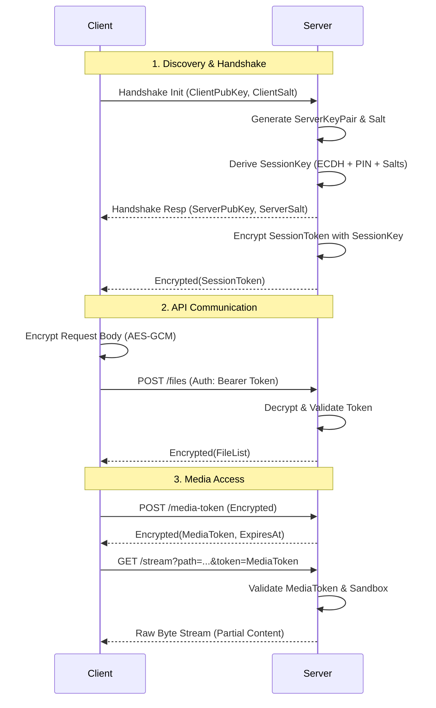
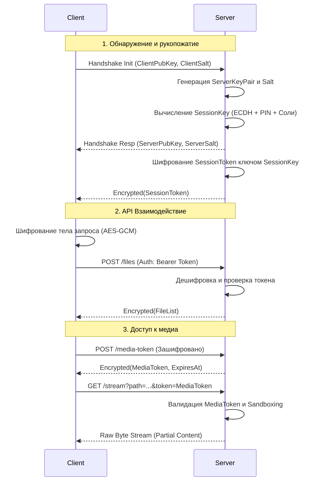

# CoonLanExplorer — Security Architecture / Архитектура безопасности

[English](#english) | [Русский](#russian)

---

<a name="english"></a>
## English: Security Architecture

CoonLanExplorer implements a multi-layered security model designed for local network environments where the underlying transport medium may be untrusted. 

---

### 1. Architectural Overview

*   **Key Exchange**: ECDH (Elliptic Curve Diffie-Hellman) using the P-256 curve.
*   **Key Derivation**: HKDF-SHA256.
*   **Data Encryption**: AES-256-GCM (Galois/Counter Mode).
*   **Authentication**: Bearer Token & PIN-based Pre-Shared Key (PSK).
*   **Defensive Guardrails**: IP-based rate limiting, canonical path sandboxing, and session state tracking.

---

### 2. Core Protocol Stages

#### Phase 0: Server Discovery & Parameter Exchange
Before a connection is initialized, the client obtains the server's network parameters via one of two mechanisms:
1.  **mDNS (ZeroConf)**: The server broadcasts its availability over the local subnet. The client auto-detects the host’s IP and port.
2.  **QR-Code**: The server GUI generates a JSON-encoded `QrCodeData` object containing the IP, port, PIN, and server name. Reading the QR-code establishes an out-of-band, trusted channel for the PIN parameter, enabling automatic key derivation.

#### Phase 1: Cryptographic Handshake
The E2EE channel is negotiated via a WebSocket connection on the `/handshake` endpoint.

```
 Client (App)                                               Server (CoonLan)
      │                                                            │
      │ ─── Alternative A: Network Discovery (mDNS/ZeroConf) ────► │ (Broadcasts IP/Port)
      │ ◄── Alternative B: QR-Code Scan (IP, Port, PIN) ───────── │ (OOB Secure Channel)
      │                                                            │
      │ ───────────────────────────────────────────────────────────┤
      │ [Handshake Stage (WebSocket @ /handshake)]                  │
      │                                                            │
      │ 1. Generate ephemeral ECDH keypair (P-256)                 │
      │    and Client_Salt (16 bytes)                              │
      │                                                            │
      │ 2. Send SecureMessage.Handshake(Client_PK, Client_Salt)    │
      │ ─────────────────────────────────────────────────────────► │
      │                                                            │ 3. Evaluate Rate Limits
      │                                                            │    (<= 5 attempts / 30s)
      │                                                            │ 4. Generate ephemeral ECDH
      │                                                            │    keypair & Server_Salt (16B)
      │                                                            │ 5. Compute ECDH Shared Secret
      │                                                            │ 6. Derive SessionKey via
      │                                                            │    HKDF-SHA256 (Salts + PIN)
      │                                                            │ 7. Generate Bearer Token
      │                                                            │    (32 characters)
      │                                                            │
      │ 8. Send SecureMessage.Handshake(Server_PK, Server_Salt, Token)
      │ ◄───────────────────────────────────────────────────────── │
      │                                                            │
      │ 9. Compute ECDH Shared Secret                              │
      │ 10. Derive SessionKey via                                  │
      │     HKDF-SHA256 (Salts + PIN input)                        │
      │ 11. Store Bearer Token for authorization                   │
      ▼                                                            ▼
```

1.  **Client Request**:
    *   Generates an ephemeral **ECDH (P-256)** keypair.
    *   Generates a cryptographically secure random `Client_Salt` (16 bytes).
    *   Dispatches a `SecureMessage.Handshake(publicKey, salt)` payload to the server.
2.  **Server Verification & Response**:
    *   Evaluates client IP against rate-limiting pools (maximum of 5 handshake attempts per 30 seconds).
    *   Generates its own ephemeral **ECDH (P-256)** keypair and a random `Server_Salt` (16 bytes).
    *   Calculates the `Shared Secret` using its private key and the client's public key.
    *   Derives the symmetric `SessionKey` using **HKDF-SHA256**:
        *   **Salt**: Concatenation of `Client_Salt` and `Server_Salt`.
        *   **Info**: `"session-key-[PROTOCOL_VERSION]:"` concatenated with the user-defined **PIN-code (PSK)**.
    *   Generates a cryptographically strong 32-character **Bearer Token**.
    *   Allocates a session tied to the generated token.
    *   Replies with `SecureMessage.Handshake(serverPublicKey, serverSalt, token)`.
3.  **Client Processing**:
    *   Computes the matching `Shared Secret`.
    *   Derives the local copy of the `SessionKey` using the user's PIN input (or QR-delivered PIN).
    *   Persists the **Bearer Token** for subsequent transactions.

---

### 3. API Communication (Encrypted Transit)

All structured metadata (directories, server status, file listings) is protected against passive sniffing and active interception.

*   **Encryption Scheme**: AES-256-GCM. GCM provides Authenticated Encryption with Associated Data (AEAD), ensuring payload confidentiality and cryptographic integrity.
*   **Payload Envelope**: Encapsulated as `SecureMessage.Encrypted(iv, data)` where `iv` is a unique 12-byte initialization vector, and `data` is the ciphertext.

```
 Client (App)                                               Server (CoonLan)
      │                                                            │
      │ 1. Serialize request payload to JSON                       │
      │ 2. Encrypt JSON payload using SessionKey (AES-256-GCM)     │
      │                                                            │
      │ 3. Dispatch HTTP request (e.g., POST /files)               │
      │    Header: Authorization: Bearer <Token>                   │
      │    Body: SecureMessage.Encrypted(iv, data)                 │
      │ ─────────────────────────────────────────────────────────► │
      │                                                            │ 4. Verify Bearer Token
      │                                                            │    and access permissions
      │                                                            │ 5. Decrypt body via SessionKey
      │                                                            │ 6. Process business logic
      │                                                            │ 7. Serialize response to JSON
      │                                                            │ 8. Encrypt response via GCM
      │                                                            │
      │ 9. Return HTTP 200 OK                                      │
      │    Body: SecureMessage.Encrypted(iv, encrypted_data)       │
      │ ◄───────────────────────────────────────────────────────── │
      │                                                            │
      │ 10. Verify GCM authentication tag                          │
      │ 11. Decrypt response payload                               │
      │ 12. Parse and handle JSON data                             │
      ▼                                                            ▼
```

---

### 4. File Transfers & Media Streaming

To avoid unnecessary CPU overhead on lower-powered host systems or mobile devices, large binary payloads (such as file downloads and video streams) are not doubly encrypted with AES-GCM at the application level. Instead, transport safety relies on targeted access control and file isolation.

```
 Client (App)                                               Server (CoonLan)
      │                                                            │
      │ 1. GET /stream?token=<MediaToken>&path=<CanonicalPath>     │
      │ ─────────────────────────────────────────────────────────► │
      │                                                            │ 2. Extract and validate MediaToken
      │                                                            │ 3. Check token lifetime (10 min)
      │                                                            │ 4. Path Sandboxing: Resolve target
      │                                                            │    to canonical path; verify it 
      │                                                            │    lies within allowed shares
      │                                                            │
      │ 5. HTTP 200 OK / 206 Partial Content                       │
      │    Body: Raw Byte Stream (unciphered content)              │
      │ ◄───────────────────────────────────────────────────────── │
      │                                                            │
      │ 6. Consume and play/write binary stream                    │
      ▼                                                            ▼
```

*   **Media Access Tokens**: Because standard media players and operating-system thumbnail engines often cannot attach custom authorization headers, the system isolates these requests using short-lived (10-minute), single-use **UUID-based Media Tokens**.
*   **Token Scope Restriction**: Media tokens grant exclusive read access to streaming and download endpoints. They cannot be used to execute commands, query directories, or perform administrative tasks.
*   **Automatic Rotation**: Clients automatically request a refreshed media token 30 seconds before expiration.
*   **Path Sandboxing**: The server converts all target file requests to their canonical form. It validates that the absolute canonical path strictly resides inside a user-defined shared directory. Directory traversal attempts (e.g., using `../`) are rejected.

---

### 5. Session Lifecycle Management

The server actively manages session states to prevent stale authentications and unauthorized reuse.

```
 [ Start ] ───► (Handshake) ───► [ Active State ] 
                                        │
       ┌────────────────────────────────┼────────────────────────────────┐
       ▼ (TTL Expired: 1 Hour)          ▼ (WebSocket Dropped)            ▼ (IP or SSID Shift)
 [ Session Expired ]            [ State: DISCONNECTED ]         [ Emergency Revocation ]
       │                                │                                │
       ▼                                ▼ (30-second Grace Period)       ▼
 [ Key Erasure ]                [ Automatic Purge ]             [ Immediate Global Reset ]
```

*   **Session TTL**: Active sessions are limited to an absolute Time-To-Live (TTL) of 1 hour. Upon expiration, the session key material is wiped from memory.
*   **Presence Tracking**: The server monitors client connections using WebSocket keep-alives. If a disconnect is detected, the session transitions to `DISCONNECTED`. If the connection is not restored within 30 seconds, the session is purged.
*   **Network Bound Verification**: If the server detects a change in host IP or local network state (SSID modification), an emergency revocation event is triggered, immediately terminating all active sessions and forcing a fresh key exchange.

---

### 6. Protocol Flow Diagram (KMP Cryptography Engine)



---

<a name="russian"></a>
## Русский: Архитектура безопасности

CoonLanExplorer использует многоуровневую модель безопасности, разработанную для локальных сетей, где физический или транспортный уровень соединения может быть общедоступным или недоверенным.

---

### 1. Общие принципы и протоколы

*   **Согласование ключей**: ECDH (Elliptic Curve Diffie-Hellman) на эллиптической кривой P-256.
*   **Деривация ключей**: HKDF-SHA256.
*   **Шифрование данных API**: симметричный алгоритм AES-256-GCM (Galois/Counter Mode).
*   **Аутентификация**: Bearer Token совместно с PIN-кодом (PSK) для вычисления ключа.
*   **Защитные рубежи**: защита от перебора (Rate Limiting), изоляция путей (Path Sandboxing) и контроль сетевого окружения.

---

### 2. Ключевые этапы протокола

#### Этап 0: Обнаружение сервера (Discovery)
Прежде чем начать обмен ключами, клиент получает сетевые параметры сервера одним из двух способов:
1.  **mDNS (ZeroConf)**: Сервер вещает о себе в локальном сегменте сети. Клиент автоматически определяет IP-адрес и порт.
2.  **QR-код**: Сервер генерирует JSON-объект `QrCodeData` (IP, порт, PIN, имя устройства) и выводит его в виде QR-кода. Считывание QR-кода обеспечивает доверенный (физический) канал передачи PIN-кода для деривации ключей.

#### Этап 1: Рукопожатие (Handshake)
Процесс установления сквозного шифрования (E2EE) происходит по протоколу WebSocket на эндпоинте `/handshake`.

```
 Клиент (App)                                               Сервер (CoonLan)
      │                                                            │
      │ ── Способ А: Обнаружение в сети (mDNS / ZeroConf) ───────► │ (Вещает IP и порт)
      │ ◄─ Способ Б: Сканирование QR-кода (IP, Port, PIN) ─────── │ (Доверенный канал)
      │                                                            │
      │ ───────────────────────────────────────────────────────────┤
      │ [Этап рукопожатия (WebSocket @ /handshake)]                │
      │                                                            │
      │ 1. Генерация временной пары ECDH (P-256)                   │
      │    и соли Client_Salt (16 байт)                            │
      │                                                            │
      │ 2. SecureMessage.Handshake(Client_PK, Client_Salt)         │
      │ ─────────────────────────────────────────────────────────► │
      │                                                            │ 3. Проверка лимита запросов
      │                                                            │    (не более 5 поп. / 30 сек)
      │                                                            │ 4. Генерация временной пары ECDH
      │                                                            │    и соли Server_Salt (16 B)
      │                                                            │ 5. Вычисление Shared Secret
      │                                                            │ 6. Деривация сессионного ключа
      │                                                            │    через HKDF-SHA256 (Соли + PIN)
      │                                                            │ 7. Генерация Bearer Token
      │                                                            │    (32 символа)
      │                                                            │
      │ 8. SecureMessage.Handshake(Server_PK, Server_Salt, Token)  │
      │ ◄───────────────────────────────────────────────────────── │
      │                                                            │
      │ 9. Вычисление Shared Secret                                │
      │ 10. Деривация сессионного ключа                            │
      │     через HKDF-SHA256 (Соли + введенный PIN)               │
      │ 11. Сохранение Bearer Token                                │
      ▼                                                            ▼
```

1.  **Запрос Клиента**:
    *   Генерирует эфемерную пару ключей **ECDH (P-256)**.
    *   Создает криптографически стойкую случайную соль `Client_Salt` (16 байт).
    *   Отправляет структуру `SecureMessage.Handshake(publicKey, salt)` на сервер.
2.  **Ответ Сервера**:
    *   Проверяет IP-адрес клиента на предмет превышения лимитов (не более 5 попыток рукопожатия за 30 секунд).
    *   Генерирует свою временную пару ключей **ECDH (P-256)** и соль `Server_Salt` (16 байт).
    *   Вычисляет общий секрет (`Shared Secret`) на основе своего закрытого ключа и открытого ключа клиента.
    *   Генерирует рабочий ключ сессии `SessionKey` при помощи **HKDF-SHA256**:
        *   **Salt**: конкатенация `Client_Salt` и `Server_Salt`.
        *   **Info**: `"session-key-[PROTOCOL_VERSION]:"` + установленный на сервере **PIN-код (PSK)**.
    *   Генерирует случайный 32-символьный **Bearer Token**.
    *   Создает и регистрирует сессию, привязанную к этому токену.
    *   Отправляет клиенту `SecureMessage.Handshake(serverPublicKey, serverSalt, token)`.
3.  **Обработка на стороне Клиента**:
    *   Вычисляет общий секрет (`Shared Secret`).
    *   Выполняет деривацию ключа `SessionKey`, используя введенный пользователем (или полученный из QR-кода) PIN-код.
    *   Сохраняет полученный **Bearer Token** для последующих запросов API.

---

### 3. Безопасность API (Передача структурированных данных)

Все транзакции обмена метаданными (структура папок, статус, настройки) зашифрованы для предотвращения перехвата и модификации данных в транзите.

*   **Алгоритм шифрования**: AES-256-GCM. Режим GCM гарантирует целостность сообщений (AEAD): любые попытки подмены зашифрованных пакетов на транспортном уровне вызовут ошибку аутентификации на принимающей стороне.
*   **Контейнер данных**: Запросы упаковываются в структуру `SecureMessage.Encrypted(iv, data)`, где `iv` — уникальный вектор инициализации (12 байт), а `data` — зашифрованная строка JSON.

```
 Клиент (App)                                               Сервер (CoonLan)
      │                                                            │
      │ 1. Сериализация запроса в JSON                             │
      │ 2. Шифрование JSON-тела ключом сессии (AES-256-GCM)        │
      │                                                            │
      │ 3. HTTP-запрос (например, POST /files)                     │
      │    Заголовок: Authorization: Bearer <Token>                │
      │    Тело: SecureMessage.Encrypted(iv, data)                 │
      │ ─────────────────────────────────────────────────────────► │
      │                                                            │ 4. Валидация Bearer Token
      │                                                            │    и прав доступа к папке
      │                                                            │ 5. Расшифровка тела через SessionKey
      │                                                            │ 6. Выполнение бизнес-логики
      │                                                            │ 7. Сериализация ответа в JSON
      │                                                            │ 8. Шифрование ответа (AES-GCM)
      │                                                            │
      │ 9. HTTP-ответ 200 OK                                       │
      │    Тело: SecureMessage.Encrypted(iv, encrypted_data)       │
      │ ◄───────────────────────────────────────────────────────── │
      │                                                            │
      │ 10. Проверка целостности тега GCM                          │
      │ 11. Расшифровка сессионным ключом                          │
      │ 12. Парсинг и обработка JSON                               │
      ▼                                                            ▼
```

---

### 4. Передача файлов и стриминг (Download/Stream)

Для минимизации избыточной нагрузки на процессоры мобильных устройств и серверов, бинарные потоки данных (загрузка файлов, воспроизведение видео и аудио) не шифруются повторно алгоритмом AES-GCM на прикладном уровне. Вместо этого защита обеспечивается механизмами разграничения доступа.

```
 Клиент (App)                                               Сервер (CoonLan)
      │                                                            │
      │ 1. GET /stream?token=<MediaToken>&path=<CanonicalPath>     │
      │ ─────────────────────────────────────────────────────────► │
      │                                                            │ 2. Извлечение и проверка MediaToken
      │                                                            │ 3. Контроль времени жизни (10 мин)
      │                                                            │ 4. Path Sandboxing: приведение к
      │                                                            │    каноническому виду и проверка 
      │                                                            │    вхождения в список разрешенных
      │                                                            │
      │ 5. HTTP 200 OK / 206 Partial Content                       │
      │    Тело: Raw Byte Stream (незашифрованный поток данных)    │
      │ ◄───────────────────────────────────────────────────────── │
      │                                                            │
      │ 6. Чтение и обработка бинарного потока                     │
      ▼                                                            ▼
```

*   **Одноразовые медиа-токены**: Стандартные проигрыватели и движки генерации превью часто не позволяют передавать кастомные HTTP-заголовки авторизации. Для таких сценариев клиент запрашивает короткоживущие (10 минут) **Media Tokens** на базе UUID.
*   **Ограничение области действия**: Медиа-токен предоставляет доступ исключительно к эндпоинтам скачивания и стриминга. По нему невозможно запросить структуру папок или выполнить административные действия.
*   **Автоматическое обновление**: Клиент выполняет ротацию (запрашивает новый медиа-токен) за 30 секунд до истечения срока его действия.
*   **Изоляция путей (Path Sandboxing)**: При запросе файла сервер приводит указанный путь к его каноническому (абсолютному) виду. Сервер проверяет, входит ли этот путь в список разрешенных папок, настроенных пользователем. Попытки выхода за пределы песочницы (например, через `../`) блокируются.

---

### 5. Жизненный цикл сессии и защитные меры

Сервер контролирует состояние соединений во избежание повторного использования неактивных сессий или компрометации данных при изменении сетевого окружения.

```
 [ Начало ] ───► (Рукопожатие) ───► [ Активное состояние ] 
                                           │
       ┌───────────────────────────────────┼───────────────────────────────────┐
       ▼ (Истечение TTL: 1 час)            ▼ (Разрыв WebSocket)                ▼ (Смена IP или SSID)
 [ Сессия аннулирована ]          [ Состояние: DISCONNECTED ]        [ Экстренный сброс ]
       │                                   │                                   │
       ▼                                   ▼ (Таймаут 30 секунд)               ▼
 [ Удаление ключей ]              [ Удаление сессии ]                [ Полное обнуление всех сессий ]
```

*   **Session TTL**: Время жизни активной сессии ограничено 1 часом. По истечении этого времени сессионные ключи гарантированно удаляются из памяти.
*   **Контроль присутствия**: Статус клиента отслеживается с помощью WebSocket-сообщений (keep-alive). При обрыве соединения сессия переходит в статус `DISCONNECTED`. Если клиент не восстановил подключение в течение 30 секунд, сессия удаляется.
*   **Контроль сетевого интерфейса**: При обнаружении изменения IP-адреса хоста или смене беспроводной сети (SSID) сервер немедленно аннулирует все текущие сессии и сбрасывает ключи.

---

### 6. Схема взаимодействия компонентов (KMP Cryptography Engine)


